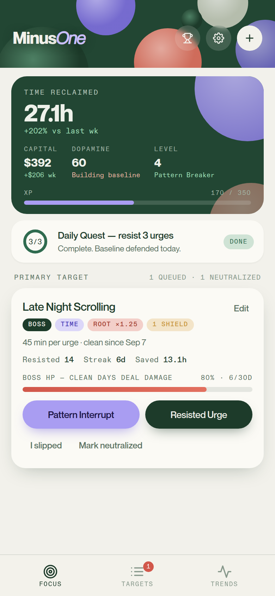
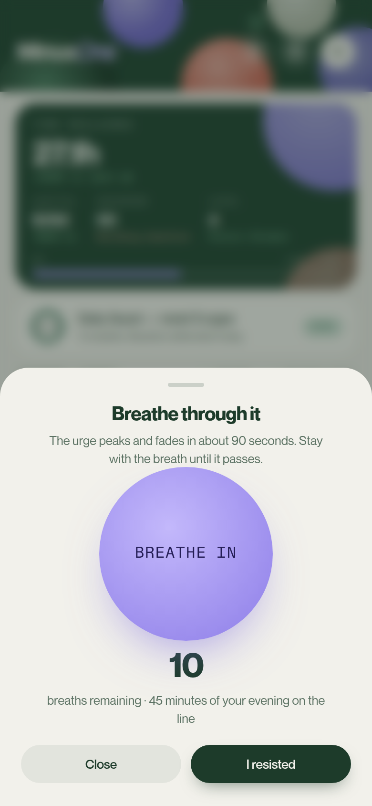
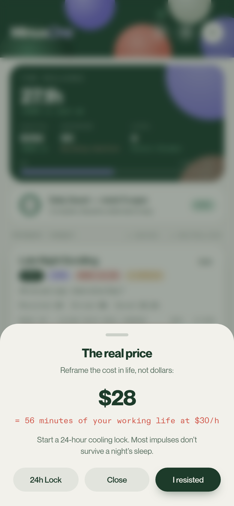
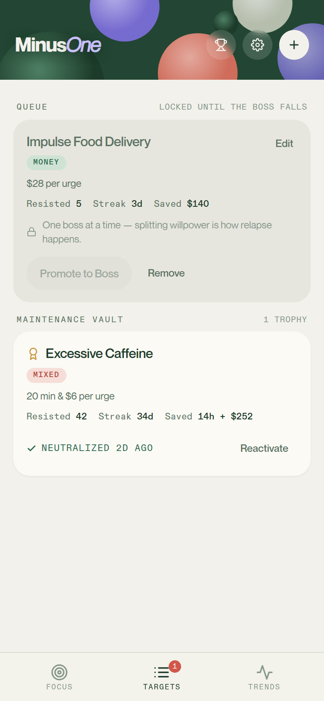
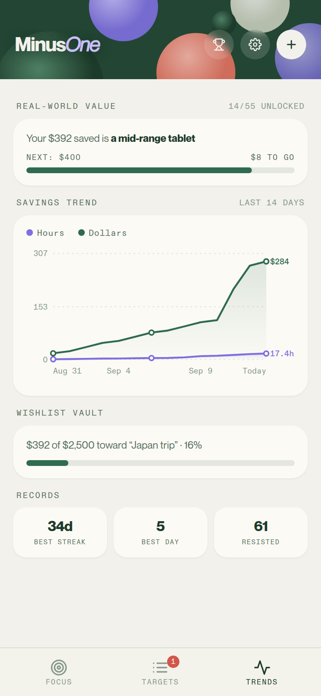
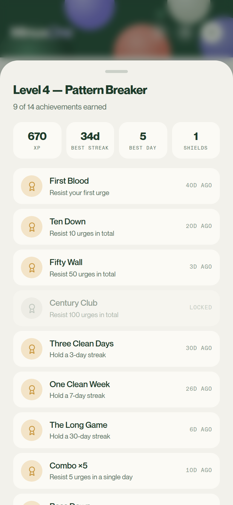
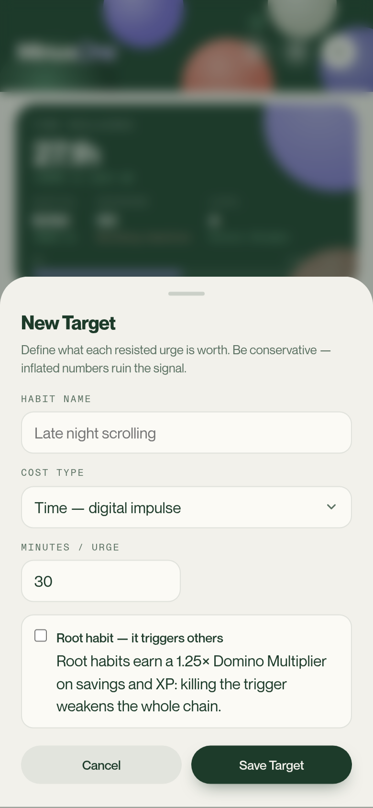

# MinusOne

> **A habit-subtraction app built on "addition by subtraction":** instead of adding new habits, systematically eliminate the one behavior costing you the most, one boss battle at a time.

**Live app:** https://whos-json.github.io/minusone/. Open it on your phone and Add to Home Screen for the full-screen offline experience.

---

## Overview

Most habit trackers pile on more things to do. MinusOne inverts the model: you
pick the single behavior costing you the most time or money (late-night
scrolling, impulse food delivery, one more coffee) and fight it like a video
game boss. Everything else queues until the active boss is neutralized (a
30-day clean streak), because splitting willpower is how relapse happens.

Removing a destructive habit is more effective than starting a positive one because it stops a constant drain on your energy. Fixing this leak halts ongoing damage and prevents a mental tug-of-war, disrupting automatic triggers to clear the focus needed for real growth.

It's a single-file progressive web app: no build step, no server, no accounts.
All data lives in the browser's localStorage, with JSON export/import for
ownership. Installable to the iOS/Android home screen and fully offline via a
service worker.

---

## Feature Showcase

### Focus Screen

*The home screen: a session summary card (time reclaimed, capital saved, dopamine baseline score, XP level), the daily quest, and the Active Boss card, streak, boss HP bar driven by clean days, and the three honest actions: Pattern Interrupt, Resisted Urge, and "I slipped".*

### Pattern Interrupt: Digital Habits

*For digital/time habits, the interrupt is a guided-breathing sheet: an animated breath pacer, a countdown of breaths remaining, and the stake spelled out ("45 minutes of your evening on the line"). The urge peaks and fades in about 90 seconds, the app makes you outlast it.*

### Pattern Interrupt: Financial Habits

*Financial urges get reframed into hours of your working life at your configured wage, "$28 = 56 minutes of your working life at $30/h", with a 24-hour cooling lock, because most impulses don't survive a night's sleep.*

### Target Queue & Maintenance Vault

*The Targets tab enforces the Focus Horizon: queued habits stay locked until the boss falls; neutralized habits retire to a Maintenance Vault with a trophy and can be reactivated if they creep back.*

### Trends & Real-World Value

*The Trends tab: cumulative hours/dollars saved over 14 days, personal records, a wishlist vault tracking savings toward a named goal, and the Real-World Value ladder, every $50 saved unlocks a tangible equivalent, from a pair of Vans to a new SUV at $30,000.*

### Levels & Achievements

*XP with domino/combo bonuses feeds 10 level titles and 14 achievements, resist milestones, streak walls, boss kills, plus streak shields earned along the way.*

### Frictionless Setup

*Adding a target takes four fields: name, whether it costs time, money, or both, the per-urge cost, and an optional "root habit" flag that multiplies its scoring, because some habits cause the others.*

---

## Core Design Decisions

1. **Focus Horizon**: exactly one Active Boss at a time; new habits queue
   until the current boss is neutralized by a 30-day streak.
2. **Context-specific interrupts**: guided breathing for digital urges, a 24h
   cooling lock with cost-in-working-hours for financial ones, a somatic
   grounding checklist for physical ones.
3. **Honest tracking**: an "I slipped" button resets the streak without
   erasing lifetime totals, and every logged resist can be undone; the system
   never punishes truthfulness with data loss.
4. **Real-world stakes**: savings convert into concrete purchases and a named
   goal, not abstract points; XP and achievements layer on top rather than
   replacing the real number.
5. **Zero-dependency engineering**: one HTML file, vanilla JS, service-worker
   offline support, device-aware sizing that measures the real viewport instead
   of trusting `dvh`, and a 106-scenario in-browser test suite.

---

## License

This is a public showcase repository: it contains the project README and
feature screenshots only. The source code is private; access can be arranged
on request for portfolio review. All rights reserved.
